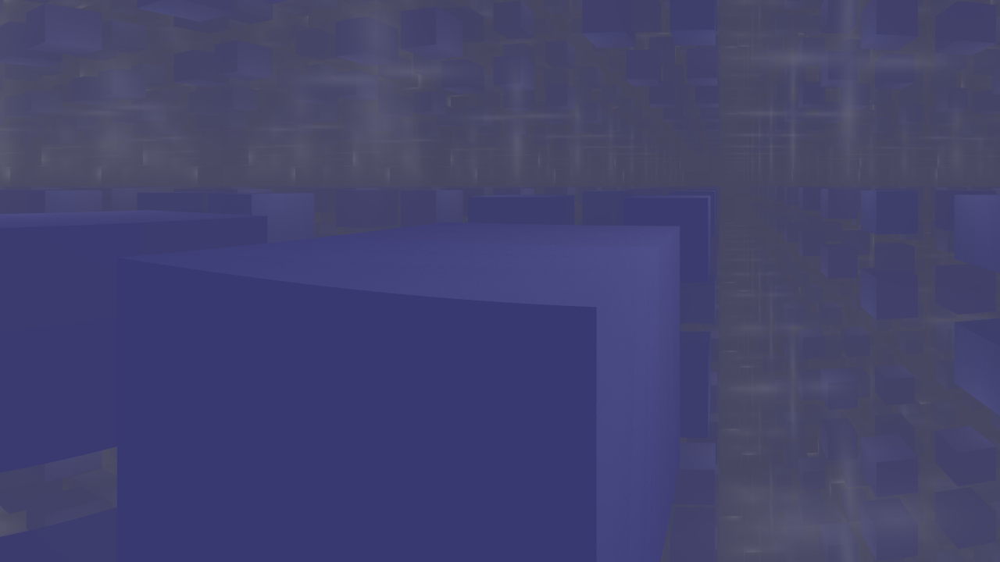
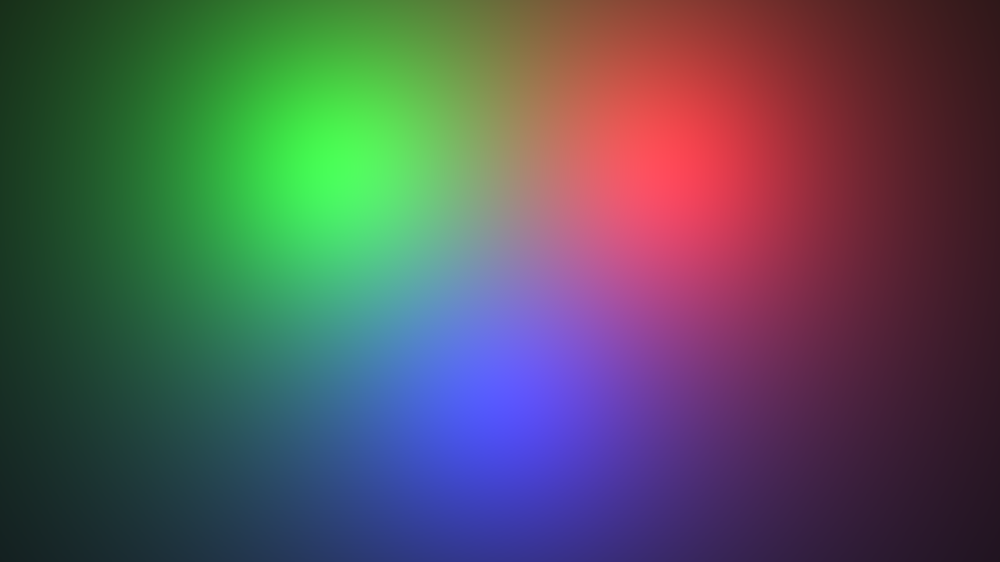
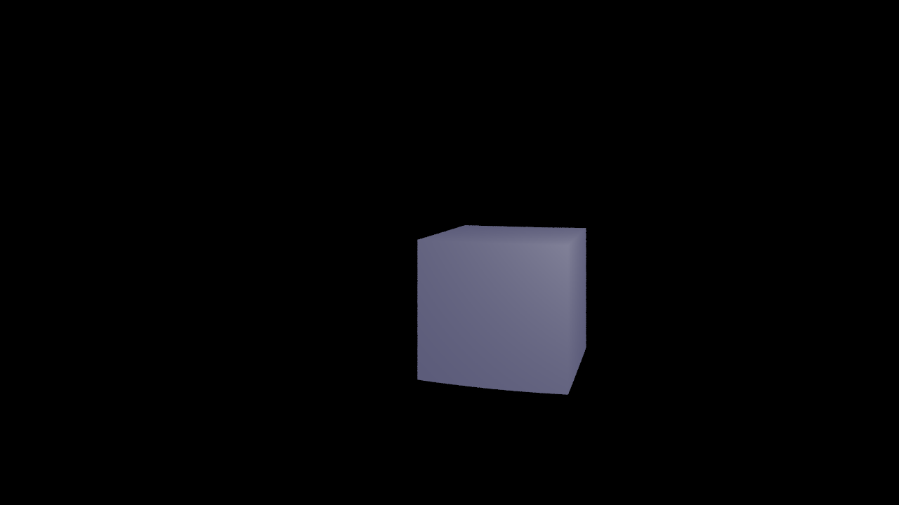

# faraway

An educational raytracer for rendering scenes, featuring lights and reflection.


Reflections

Faraway uses `.fscene` files to generate realistic looking shadows and reflections.


Color mixing

It can accurately mix colors from lights on surfaces,


use multiple lights to generate shadows layered on top of each other,



and create high level shapes instead of just triangles.

To run the raytracer, provide a path like so:

```
compiled_jar my_scene.fscene
```

You can use the fscene examples if you want to make your own scenes.
